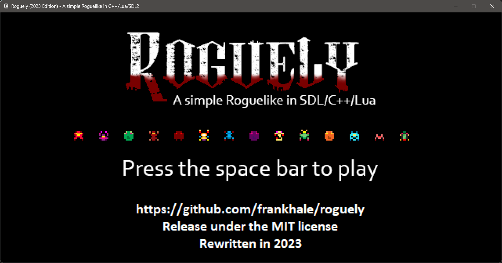
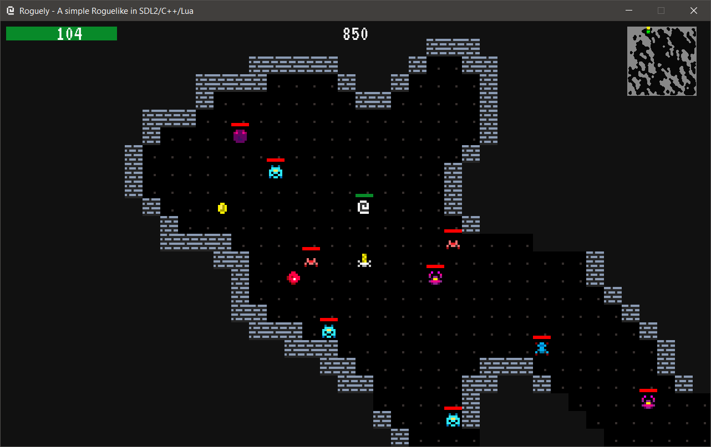
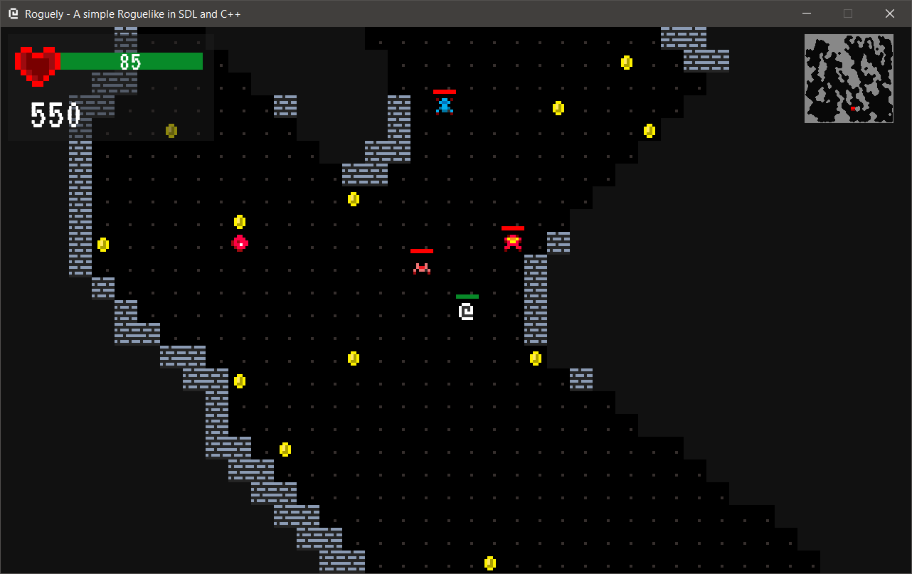
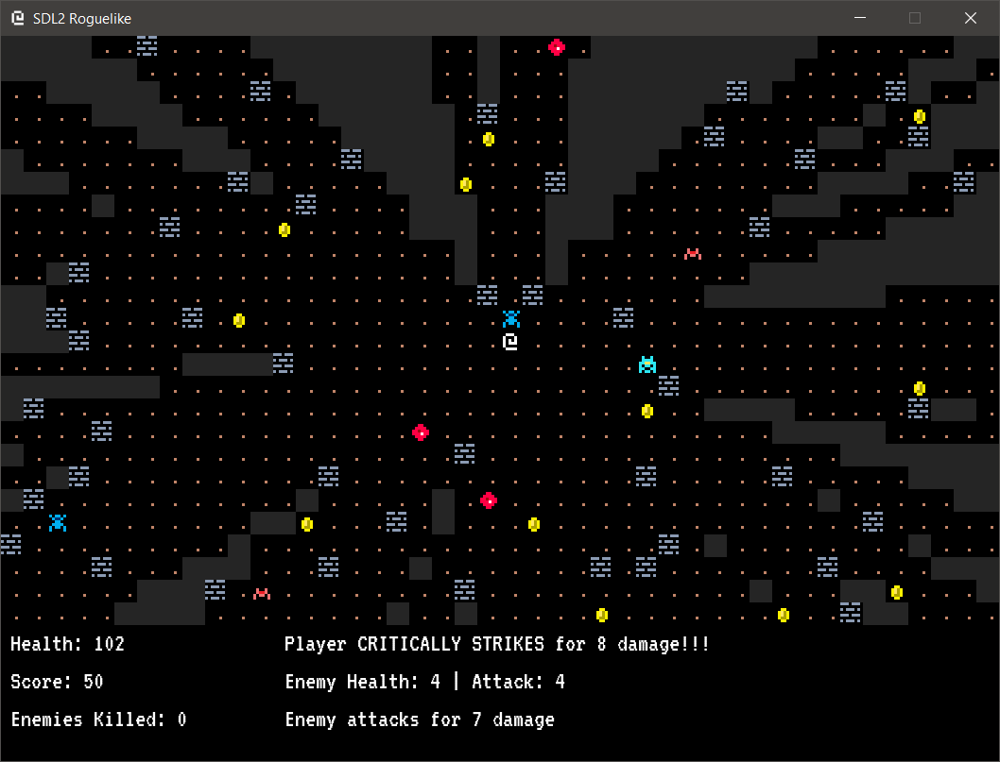
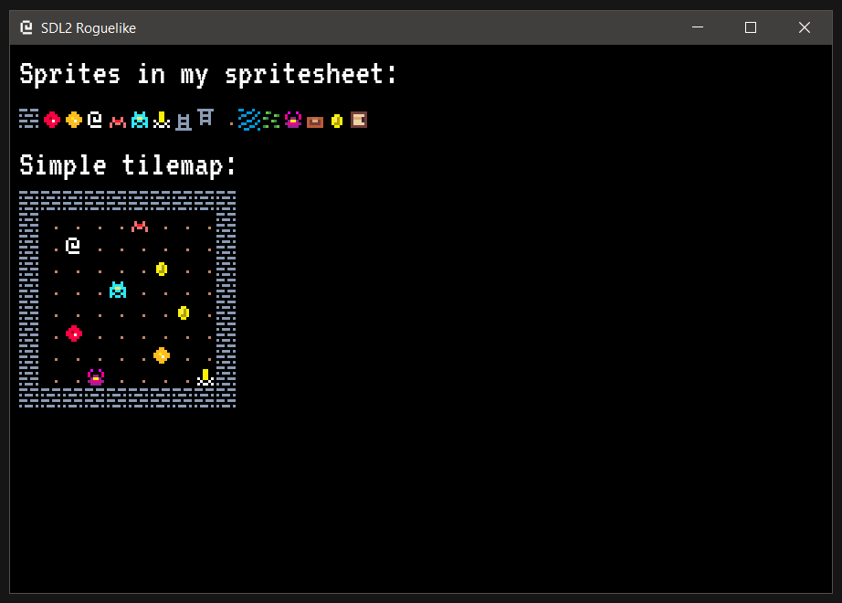

# Roguely

NOTE: This is a work in progress...

Roguely is a very simple Roguelike in SDL/C++/Lua.

The game is using very simple cellular automata to generate maps. Each time you
run the game you'll get a new map. Enemies spawn, move around randomly and you
can attack them to increase your score. You can pick up health gems and coins.
Dead enemies spawn a treasure chest with a chance to increase health and score.
Look for the golden candle and if you collect it you will win the game.

There is no enemy AI yet. Enemies won't aggro on you. You can avoid enemies
easily. This is an area that I plan to invest some time on in the future.

The screenshot below shows off game sprites that are in the current iteration
of the sprite sheet. Not all sprites in this screenshot are currently being used
in the game. There is still a lot of work still left to do.

## Next Steps

This concluded during rewrite.

- [x] Switch from manual dependency configuration to `vcpkg`
- [x] Refactor current code so we can:
  - [x] Integrate Lua
  - [x] Finish ECS system
  - [x] Move all in game objects (including player) to entities
  - [x] Remove hard coded entity references that we have now
  - [x] Optimize rendering pipeline
  - [ ] Expand the title screen to add a screen to document how the game is played and who the enemies are as well as what the objectives are.

## Tileset

I've included the Photoshop file that was used to create the tileset. My
workflow is to develop tiles in 8x8 and then upscale them to 32x32 and then
export the tileset as a PNG which is used in the game.

The tileset is sort of all over the place. It's not well organized and has
ventured into some animation tiles. We aren't doing any animation yet and a lot
of these tiles are not currently being used. The main focus so far has been to
get a basic engine up, provide lua support and get something working and for
that I am very happy and recognize that there is still a long way to go before
a proper game can be made.

## Game Objectives (so far)

Not a lot to do besides run around and kill enemies and increase score. If you
run across the golden candle you win. It's highlighted in yellow on the mini
map. If the level generation spawned you in a blocked area just hit the space
bar to warp to another location.

## Screenshots

Title Screen:

Combat Text:

Current Gameplay:

We have cellular automata level generation and a minimap now

Older gameplay showing how it evolved:

My first screenshot when I was able to render sprites:

## Videos

## Building

I'm using `Visual Studio 2019 Community Preview Edition` but you can just use
regular `Visual Studio 2019 Community Edition` to build this code.

Get `Visual Studio 2019` from here: [https://visualstudio.microsoft.com/vs/](https://visualstudio.microsoft.com/vs/)

I'm using `vcpkg` for dependencies management. You can get `vckpg` here: [https://github.com/Microsoft/vcpkg](https://github.com/Microsoft/vcpkg)

Roguely has the following dependencies:

- SDL2
- SDL_image
- SDL_mixer (with mpg123 support)
- SDL_ttf
- Lua
- Sol2
- Boost (using boost/uuid, boost/numeric)

## License

MIT

## Credits for Audio

Music track `Exit Exit Proper - Pipe Choir` from:

- [http://www.pipechoir.com/](http://www.pipechoir.com/)
- [https://soundcloud.com/pipe-choir-three](https://soundcloud.com/pipe-choir-three)
- [https://freemusicarchive.org/music/P_C_III](https://freemusicarchive.org/music/P_C_III)

Creative Commons License: http://www.pipechoir.com/music-licenses.html

The sounds in the `assets/sounds` folder came from [https://opengameart.org/](https://opengameart.org/)

## Author(s)

Frank Hale &lt;frankhaledevelops@gmail.com&gt;

## Date

23 March 2021
