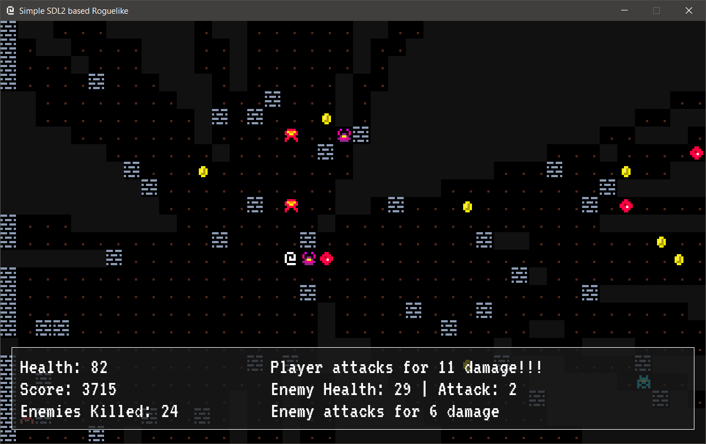

# Roguely

**NOTE: THERE IS MAJOR WORK GOING ON HERE AND IT'S NOT FINISHED...**

A simple Roguelike in SDL and C++

Test level showing off game sprites

## Status

NOTE: This is a work in progress...

The map is using simple cellular automata to generate it. Each time you run the
game you'll get a new map. Enemies spawn, move around and you can attack them to
increase your score. You can pick up health gems and coins. Dead enemies spawn a
treasure chest with a chance to increase health and score. If you kill a
`fire walker` he will spawn a treasure chest and an attack gem which increases
your attack power. Look for the golden candle and if you collect it you will
win the game.

## Next Steps

Before the code gets too messy, here is a list of things planned.

- Switch from manual dependency configuration to `vcpkg`
- Refactor current code so we can:
  - Integrate Lua
  - Finish ECS system
  - Move all in game objects (including player) to entities
  - Remove hard coded entity references that we have now
  - Optimize rendering pipeline
  - Expand the title screen to add a screen to document how the game is played
    and who the enemies are as well as what the objectives are.

In order to get there we have to figure out just how much Lua integration we'll
have and what that API will look like. The C++ side should provide the
foundation for the game but decisions about the game content should be exposed
from Lua. This is going to start shaping up over the next few weeks.

## Tileset

I've included the Photoshop file that was used to create the tileset. My
workflow is to develop tiles in 8x8 and then upscale them to 32x32 and then
export the tileset as a PNG which is used in the game.

## Screenshots

Title Screen:

Combat Text:

Current Gameplay:

We have cellular automata level generation and a minimap now

Older gameplay showing how it evolved:

My first screenshot when I was able to render sprites:

## Videos

## Building

I'm using `Visual Studio 2019 Community Preview Edition` but you can just use
regular `Visual Studio 2019 Community Edition` to build this code.

Get `Visual Studio 2019` from here: [https://visualstudio.microsoft.com/vs/](https://visualstudio.microsoft.com/vs/)

I'm using `vcpkg` for dependencies management. You can get `vckpg` here: [https://github.com/Microsoft/vcpkg](https://github.com/Microsoft/vcpkg)

Roguely has the following dependencies:

- SDL2
- SDL_image
- SDL_mixer (with mpg123 support)
- SDL_ttf
- Lua
- Sol2
- Boost (using boost/uuid, boost/numeric)

## License

MIT

## Credits for Audio

Music track `Exit Exit Proper - Pipe Choir` from:

- [http://www.pipechoir.com/](http://www.pipechoir.com/)
- [https://soundcloud.com/pipe-choir-three](https://soundcloud.com/pipe-choir-three)
- [https://freemusicarchive.org/music/P_C_III](https://freemusicarchive.org/music/P_C_III)

Creative Commons License: http://www.pipechoir.com/music-licenses.html

The sounds in the `assets/sounds` folder came from [https://opengameart.org/](https://opengameart.org/)

## Author(s)

Frank Hale &lt;frankhaledevelops@gmail.com&gt;

## Date

17 March 2021
