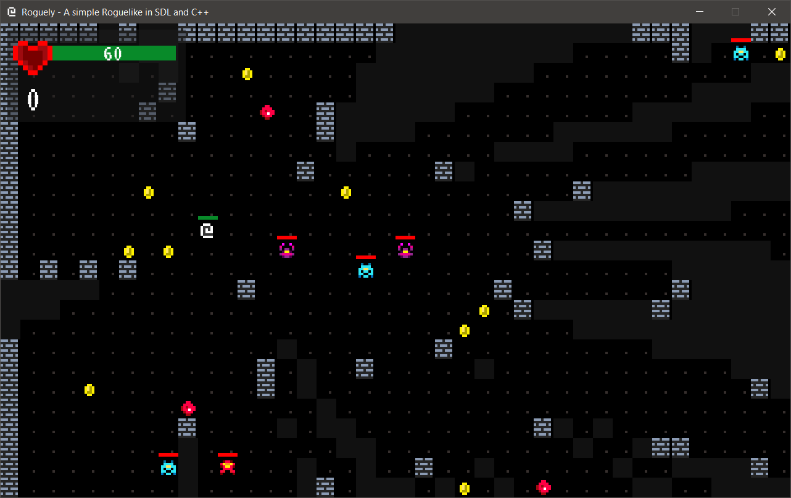
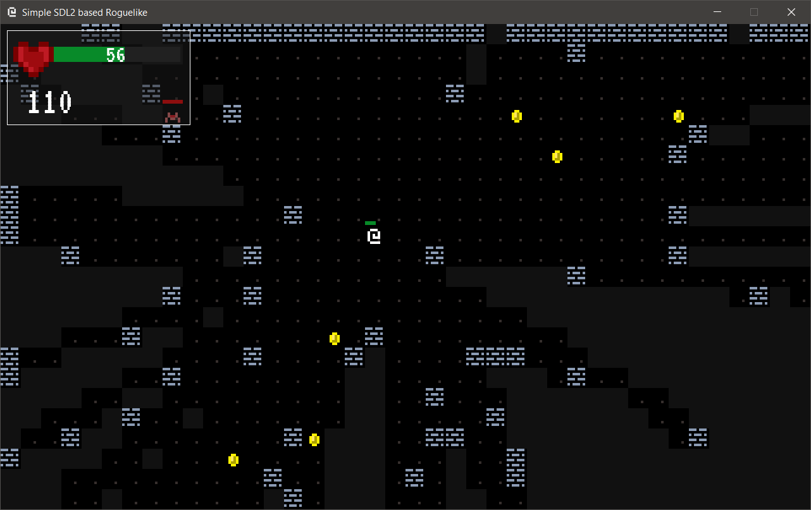

# Roguely

A simple Roguelike in SDL and C++

Test level showing off game sprites

## Status

NOTE: This is a work in progress...

The current map is just a big room with an outer wall and randomly spawned
walls inside. Enemies spawn, move around and you can attack them to increase
your score. You can pick up health gems and coins. Dead enemies spawn a
treasure chest with a chance to increase health and score. If you kill a `fire walker` he will spawn a treasure chest and an attack gem which increases your attack power. Look for the golden candle and if you collect it you will win the game.

## Tileset

I've included the Photoshop file that was used to create the tileset. My
workflow is to develop tiles in 8x8 and then upscale them to 32x32 and then
export the tileset as a PNG which is used in the game.

## Screenshots

Title Screen:

Combat Text:

Current Gameplay:

Older gameplay showing how it evolved:

My first screenshot when I was able to render sprites:

## Videos

## Building

I'm using `Visual Studio 2019 Community Preview Edition` but you can just use
regular `Visual Studio 2019 Community Edition`. The C++ project library/header
locations for SDL2 are set up the way I have it on my machine.

Get `Visual Studio 2019` from here: [https://visualstudio.microsoft.com/vs/](https://visualstudio.microsoft.com/vs/)

You can grab SDL2 from here (I'm using 64bit): [https://www.libsdl.org/download-2.0.php](https://www.libsdl.org/download-2.0.php)

You can grab the required libraries (I'm using 64bit) from here: [https://www.libsdl.org/projects/](https://www.libsdl.org/projects/)

I have put the 64 bit SDL2 Visual Studio lib/header files in the following
location:

You'll need to copy the library DLLs to the root of the project folder (eg.
right where the source code is).

If you set up your environment like this then you should be able to build
without touching the build settings. If you have trouble let me know and I'll
try to help.

## License

MIT

## Credits for Audio

Music track `Exit Exit Proper - Pipe Choir` from:

- http://www.pipechoir.com/
- https://soundcloud.com/pipe-choir-three
- https://freemusicarchive.org/music/P_C_III

Creative Commons License: http://www.pipechoir.com/music-licenses.html

## Author(s)

Frank Hale &lt;frankhaledevelops@gmail.com&gt;

## Date

3 March 2021